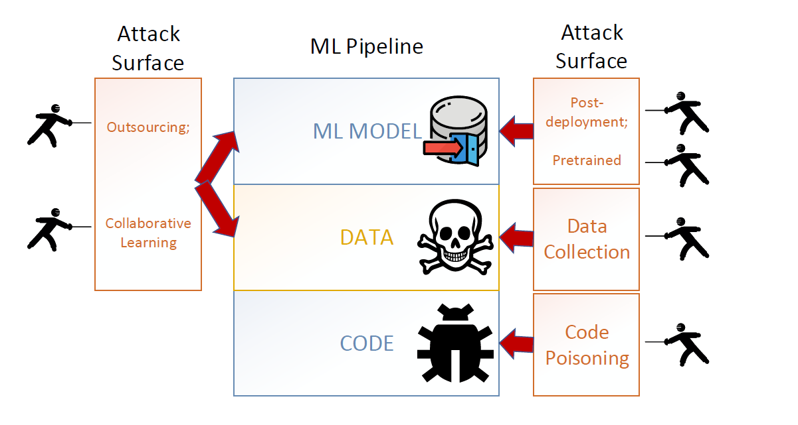

# Backdoor-Learning
An Awesome curated list of backdoor learning resources, I did not give a full list of attack/defense paper list but important and typical. If you would like to find a full list of paper, please see the supplementary part.

# 1. Introduction

The backdoor attack has several features as follows:
- It does not affect the normal performance of the system (not affect the prediction accuracy of the correct sample of the model).
- The backdoor is covert, but the attacker can use specific means to activate the backdoor to cause harm (those which can activate the input of neural network backdoor behavior or are in the input additional pattern are collectively known as trigger.)

The life time of attack in machine learning models are illustrated as follows, as we could see, backdoor can be impplemented in every process in machine learning.

</img>

Before we get started to the research survey, first I write a brief worldoverview of backdoor learning.

The **attack** can be divided into three types: 
- data-based attack
- model-based attack
- code-based attack (binary-level)

**or**

- Visible attack (visible pattern/trigger)
- invisible attack (invisible pattern/trigger)

</img>

For the **defense**, it could be divieded into two parts:
- model aspect: model inspection, model cleanse
- data aspect: input filtering, input transformation

And we still introduce some new metrics to evaluate if attack and defense succeed.
- **Attack Metrics**
    - Attack success rate (ASR): used to measure the probability that trigger input is successfully misclassified to target class by the model.Generally require that effective backdoor attacks to have high ASR.
    - Clean accuracy drop (CAD): This is a measure of the difference in the performance of the neural network implanted in the backdoor and the original network in the face of benign samples, which can describe the impact of the implanted backdoor on the neural network performance.There are low CAD.
    - Efficacy-specificity AUC (AUC): This is a quantification of the trade-off between ASR and CAD.
    - Neuron-separation ratio (NSR): A measure of the intersection between benign samples and neurons activated by trigger input.
- **Defense Metrics**
    - Attack rate deduction (ARD): This is the difference in success of attack before and after defense.This reflects how effective defense schemes are in response to attacks.The more nature the ARD shows that the better the defense effect.
    - Clean accuracy drop (CAD): This is a measure in the accuracy of the model after benign samples before and after defense.This is in observing whether the defense measures can have an effect on the normal function of the model.The smaller the CAD indicates that the smaller the effect is.
    - True positive rate (TPR): This is a unique indicator of Input-filtering-type defense schemes, measuring the ability to detect trigger input.
    - Anomaly index value (AIV): This is a unique indicator for defense schemes of type model-inspection type used to characterize the anomaly of the model implanted with the backdoor.Because we know that most of this type of approach formalizes the search backdoor model to outlier detection, each class having associated scores, most likely if the score of a given class is significantly different from the other.In general, AIV has a 95% probability to be considered anomalous if greater than 2.
    - Mask L1 norm (MLN): This is a metric specific to the defense scheme for type model-inspection type used to measure the l1 norm of trigger recovered by this scheme.
    - Mask jaccard similarity (MJS): Measure the intersection of the trigger recovered from defense prevention and itself, which is in observing the quality of the recovered trigger.
    - Average running time (ART): measures the performance of defense schemes, mainly refers to runtime.For model sanitization or model inspection types, ART is the time running on each model; for input filtering or input reformation types, ART is the time running on each input

# 2. Survey
- [A Survey on Neural Trojans (2020)](https://ieeexplore.ieee.org/document/9137011)
- [Backdoor Learning: A Survey (2021)](https://arxiv.org/abs/2007.08745)
- [Backdoor Attacks and Countermeasures on Deep Learning: A Comprehensive Review (2019)](https://arxiv.org/abs/2007.10760)
- [Deep Learning Backdoors (2021)](https://arxiv.org/abs/2007.08273)

# 3. Attacks
- BadNets: Identifying Vulnerabilities in the Machine Learning Model Supply Chain (2017) [[Code]](https://github.com/Billy1900/BadNet)
- TrojanNet: Embedding Hidden Trojan Horse Models in Neural Networks (2020) [[Code]](https://github.com/Billy1900/TrojanNet)
- Invisible Backdoor Attack with Sample-Specific Triggers (2021) [[Code]](https://github.com/yuezunli/ISSBA)

# 4. Defense
- Feature Squeezing: Detecting Adversarial Examples in Deep Neural Networks [[Code]](https://github.com/mzweilin/EvadeML-Zoo)
- STRIP: A Defence Against Trojan Attacks on Deep Neural Networks [[Code]](https://github.com/garrisongys/STRIP?utm_source=catalyzex.com)
- Fine-Pruning: Defending Against Backdooring Attacks on Deep Neural Networks [[Code]](https://github.com/kangliucn/Fine-pruning-defense)

# 5. Supplementary
- [TrojAI Literature Review](https://github.com/usnistgov/trojai-literature)
- [Backdoor Learning Resources](https://github.com/THUYimingLi/backdoor-learning-resources)

## ToolBox
- [trojanzoo](https://github.com/ain-soph/trojanzoo)
- [trojAI](https://pages.nist.gov/trojai/docs/about.html)
- [Backdoors 101](https://github.com/ebagdasa/backdoors101)
